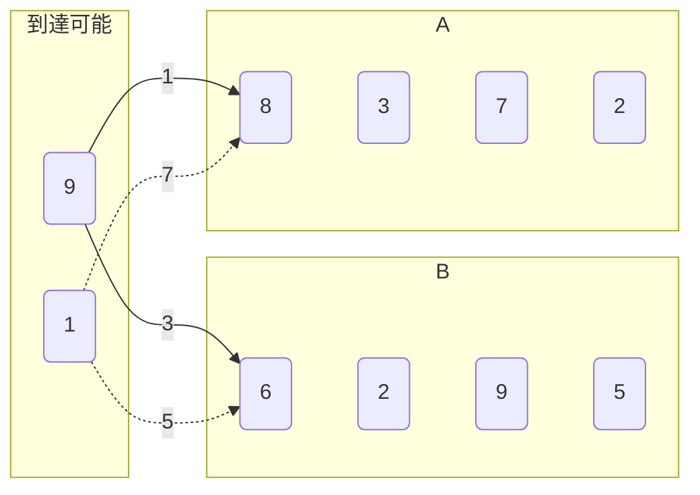
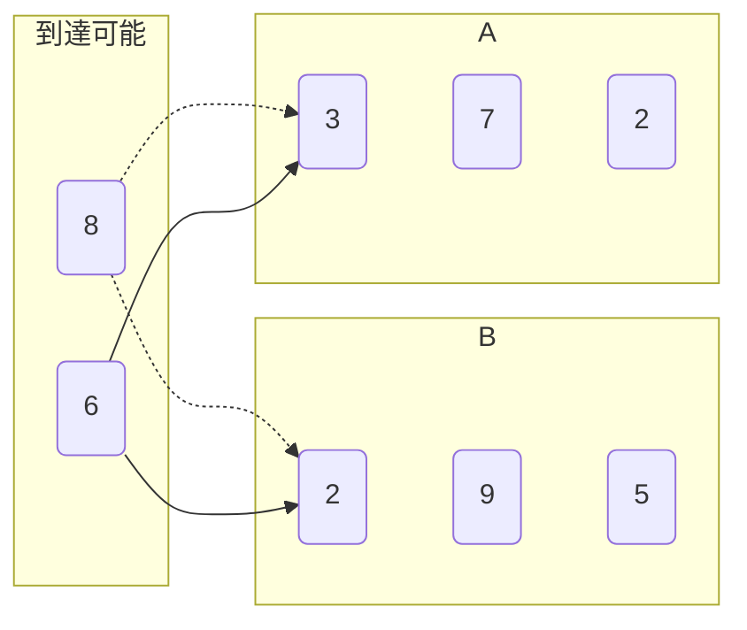
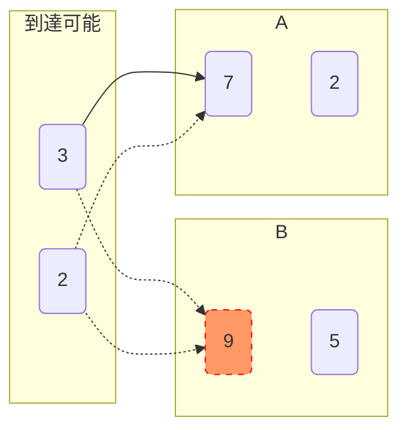
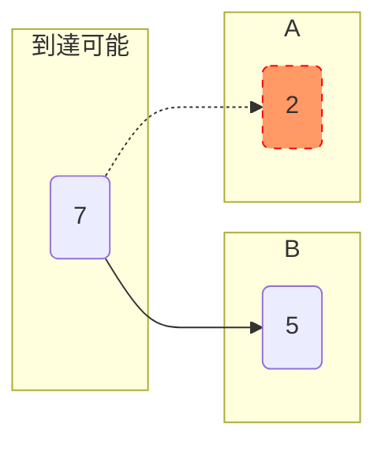
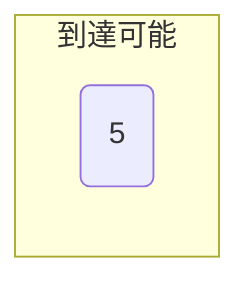

[AtCoder Beginner Contest 245](https://atcoder.jp/contests/abc245) のA～D問題の考え方のまとめです。Python & Ruby での解答例も付けました。

# A問題

[A - Good morning](https://atcoder.jp/contests/abc245/tasks/abc245_a)

「`A時B分0秒` が `C時D分1秒` より早いか」で条件分岐すればよい。

## 単純な条件分岐

1. `A < C` なら、確定で `Takahashi` （例: `3時？分` は `5時？分` より明らかに早い）
1. `A > C` なら、確定で `Aoki` （例: `5時？分` は `3時？分` より明らかに遅い）
1. `A == C` なら、追加でBとDの比較を行う
    * `B <= D` なら、`Takahashi`
    * `B > D` なら、`Aoki`

## 大小関係を保ったまま変換

○時○分○秒 という表記を使うから複雑になる。単位を秒に換算してしまえばシンプルだ。  
1分は60秒、1時間は60分=60*60秒 であるから、  
```
(60*60*A + 60*B + 0) vs (60*60*C + 60*D + 1)
```
とするとif-elseのみで実装できる。

あるいは、時、分 といった概念は一旦無視して、適当に大きい数を掛けて桁をずらしてもよいだろう。
```
(100000*A + 100*B) vs (100000*C + 100*D + 1)
```

## 日時モジュールを使う

最も正統派（？）な方針は、そのまま時刻として時刻クラスを用いることかもしれない。  
[Pythonのdatetime.timeオブジェクト](https://docs.python.org/ja/3/library/datetime.html#time-objects) や [RubyのTimeクラス](https://docs.ruby-lang.org/ja/latest/class/Time.html) は日時を扱うクラスかつ比較可能なので、これを使っても解くことができる。

Python

```python
from datetime import time
if time(A, B, 0) < time(C, D, 1):
    print('Takahashi')
else:
    print('Aoki')
```

Ruby

```ruby
if Time.new(2000, 1, 1, A, B, 0) < Time.new(2000, 1, 1, C, D, 1)
  puts 'Takahashi'
else
  puts 'Aoki'
end
```

### 解答例

* Python : https://atcoder.jp/contests/abc245/submissions/30551985
* Ruby : https://atcoder.jp/contests/abc245/submissions/30570087

# B問題

[B - Mex](https://atcoder.jp/contests/abc245/tasks/abc245_b)

0, 1, 2, 3... とカウントアップしながら、その数がAに含まれるか調べる。Aに含まれないものが1つ見つかったらそれを出力して終了する。

## 集合(set)を使う

A は数列として与えられるが、この問題では順序は無関係であり、「ある数がAに含まれているかどうか」にしか興味がないため、数列ではなく集合（set）としてAを扱うことにする。  
集合を使うことのメリットの1つは「含むかどうか」の判定処理が高速に行える点だ。

※この問題の制約Nは十分に小さいため、数列（配列）のまま扱っても間に合う。

## カウントアップ

「カウントアップしながらループ」は、十分大きい数を上限としたrangeのループを書いてもよいが、

* Python: `for i in range(10000000):`
* Ruby: `10000000.each { |i| ~ }`

無限カウントアップを使うと最大値設定のミスやチェックを減らすことができる。そしてちょっとかっこいい（？）

* Python: `for i in itertools.count():` ※[itertools.count](https://docs.python.org/ja/3/library/itertools.html#itertools.count)
* Ruby: `(0..).each { |i| ~ }` ※終端なしRange

### 解答例

* Python : https://atcoder.jp/contests/abc245/submissions/30552575
* Ruby : https://atcoder.jp/contests/abc245/submissions/30552675

# C問題

この問題は、次のように言い換えられる。  
**スタート地点からゴール地点まで、差がK以内のジャンプのみで移動可能か。なお、スタートとゴールはそれぞれ2つあり、どちらを使用してもよい。**

## 方針

**移動可能な点のみを保持しつつステップを進めていき、ゴールまで到達できるか を判定**すればよい。

短い例で動作を考える。

* `N = 3`
* `K = 4`
* `A = [9, 8, 3, 7, 2]`
* `B = [1, 6, 2, 9, 5]`

AとBを同時に、左から順に要素を見ていく。

まずは1番目(スタート)から2番目への移動を見る。



図中の実線矢印は移動可能、点線矢印は移動不可能を表す。

* Aの次の要素(8)は、(9)から移動可能
* Bの次の要素(6)は、(9)から移動可能

のため、A,Bどちらの第2要素にも到達可能である。

次に、2番目の到達可能要素から、3番目への移動を見る。



* Aの次の要素(3)は、Bの第2要素から移動可能
* Bの次の要素(7)は、Bの第2要素から移動可能

のため、A,Bどちらの第2要素にも到達可能である。

第3→第4 では、B(9)が到達不能となる。




第4→第5 では、**始点は(7)のみとなる。**




最終フェーズでも、到達可能点に要素が存在する。



**つまり、到達可能点のみでGOALに到達することができたので、回答は"Yes"となる。**

このように「そのステップでの到達可能点」のみを管理してA,Bを端から端まで見ることで判定ができる。  
もし途中で到達可能点が空になれば、"No"が答えとなる。

## 実装

数列A, Bは左から見ても右から見ても答えは変わらない。  
今回は配列をスタックとして使い、空になるまで要素を`pop`する という実装をした。（つまり、右から見る）

到達可能地点の管理は、

* 順序を無視できる
* 重複を排除したい

ことから、setを使う。

Python
```python
available_numbers = {A.pop(), B.pop()} # 現在の到達可能地点集合。スタート地点を 到達可能 として登録した
while A:
    tmp = set() # 次の 到達可能地点集合 の入れ物を用意する
    a, b = A.pop(), B.pop() # 次の点を取り出す
    for n in available_numbers:
        if abs(a - n) <= K: # 次のAに到達可能なら、到達可能点集合に追加
            tmp.add(a)
        if abs(b - n) <= K: # 次のBに到達可能なら、到達可能点集合に追加
            tmp.add(b)
    available_numbers = tmp # ステップを進める
```

Ruby

```ruby
available_numbers = Set[A.pop, B.pop] # 現在の到達可能地点集合。スタート地点を 到達可能 として登録した
until A.empty?
  tmp = Set.new # 次の 到達可能地点集合 の入れ物を用意する
  a, b = A.pop, B.pop # 次の点を取り出す
  available_numbers.each do |n|
    if (a - n).abs <= K # 次のAに到達可能なら、到達可能点集合に追加
      tmp.add(a)
    end
    if (b - n).abs <= K # 次のBに到達可能なら、到達可能点集合に追加
      tmp.add(b)
    end
  end
  available_numbers = tmp # ステップを進める
end
```

## 解答例

* Python : https://atcoder.jp/contests/abc245/submissions/30553035
* Ruby : https://atcoder.jp/contests/abc245/submissions/30553026

# D問題

[D - Polynomial division](https://atcoder.jp/contests/abc245/tasks/abc245_d)

## 方針

筆算を実装すればよい...が、その実装は複雑になりそう。  
今回の制約では割り切れることが保証されている & 商にしか興味がないため、Cを破壊的に書き換えてしまうと実装がシンプルになる。

```
      2
     ,---------
1 2 / 2  8 14 12
      2  4
      ----
      0  4
```

通常の筆算では、引き算の結果を下に書くが、  
今回はその結果でCを書き換えてしまう。

```
      2
     ,---------
1 2 / 0  4 14 12
```

インデックスの管理も面倒なので、商は別のところで管理し、Cを切り詰めていく。

```
商: 2

     ,---------
1 2 /  4 14 12
```

同様に商を1桁分求め、

```
商: 2
       4
     ,---------
1 2 /  4 14 12
       4  8
```

結果でCを上書きし

```
商: 2 4
       
     ,---------
1 2 /  0  6 12
```

切り詰める。

```
商: 2 4
       
     ,---------
1 2 /  6 12
```

```
商: 2 4
       6
     ,---------
1 2 /  6 12
       6 12
```

```
商: 2 4 6

     ,---------
1 2 / 0
```

CがAより短くなったら終わり。

## 実装

Python

```python
ans = []
while len(C) >= len(A):
    quotient = C[0] // A[0] # 商を1桁分求め、
    ans.append(quotient) # メモに追加し、
    for idx, a in enumerate(A):
        C[idx] -= a * quotient # Cを引き算で上書き
    C.pop(0) # 切り詰める
```

Ruby

```ruby
ans = []
 while C.length >= A.length
  quotient = C.first / A.first # 商を1桁分求め、
  ans << quotient # メモに追加し、
  A.each_with_index do |a, idx|
    C[idx] -= a * quotient # Cを引き算で上書き
  end
  C.shift # 切り詰める
end
```

## 解答例

* Python : https://atcoder.jp/contests/abc245/submissions/30572482
* Ruby : https://atcoder.jp/contests/abc245/submissions/30572469


<script async src="https://unpkg.com/mermaid@8.14.0/dist/mermaid.min.js"></script>
